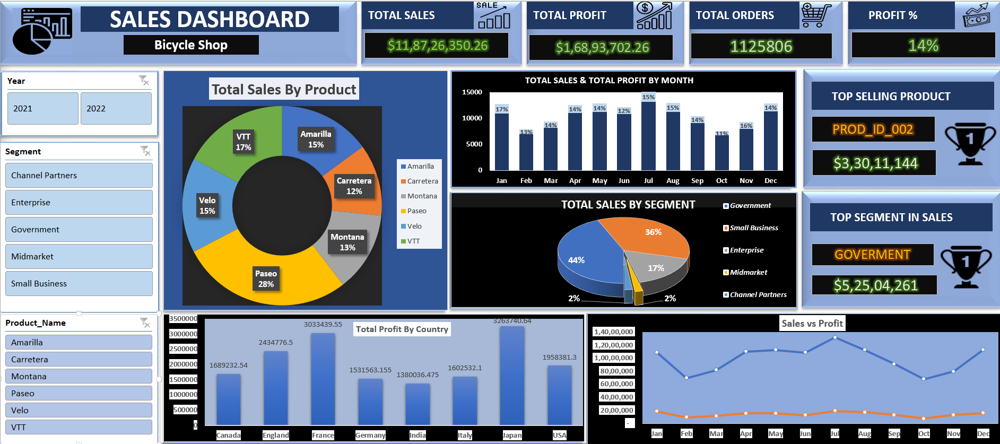

# 🚲 **Bicycle Shop Sales Dashboard**

## 📊 **Project Overview**

This interactive Excel Sales Dashboard analyzes and visualizes sales performance for a **Bicycle Shop**. The dashboard includes key business metrics to help drive data-driven decisions.

---

## 🛠 **Features**

1. **Total Sales, Profit, Orders, and Profit %**:  
   - Quick view of overall business performance.

2. **Top-Selling Product and Segment**:  
   - Displays the product and segment contributing the most to sales.

3. **Sales Trends by Month**:  
   - Visualizes total sales and profits over the months.

4. **Sales by Product**:  
   - A donut chart breaking down total sales by product.

5. **Sales by Segment**:  
   - Pie chart representing sales distribution across business segments.

6. **Total Profit by Country**:  
   - Bar chart showing profit distribution by country.

7. **Sales vs Profit Analysis**:  
   - Line chart comparing monthly sales and profit trends.

---

## 📈 **Insights Gained**

- **Top Performing Product**: `PROD_ID_002` generated the highest revenue.  
- **Leading Segment**: `Government` contributed the most to total sales.  
- **Country-wise Analysis**: France achieved the highest profits.  
- **Sales Trends**: Notable spikes in sales observed in **June** and **August**.  

